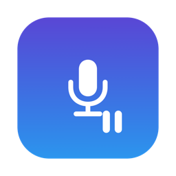

<p align="center">
  
</p>

<h1 align="center">MicPause</h1>

Pauses your music when an app starts using the microphone. Resumes when the mic
is free. Lives in the menu bar, no Dock icon.

MicPause never opens the microphone and never asks for mic permission. It
watches CoreAudio for active capture sessions.

## Install

1. Download the DMG from the
   [latest release](https://github.com/ruanmartinelli/mic-pause/releases/latest).
2. Drag MicPause to Applications.
3. The app is not notarized, so macOS blocks the first launch. Allow it under
   **System Settings → Privacy & Security → "Open Anyway"**, or run:
   ```sh
   xattr -d com.apple.quarantine /Applications/MicPause.app
   ```

Requires macOS 14.2 or later. macOS 13 works, with less reliable detection.

## Permissions

Asked for on first use:

- **Automation** — pauses Spotify and Apple Music via AppleScript.
- **Accessibility** — sends the play/pause media key for other players.

## Usage

Click the menu bar icon:

- Status line shows what is using the mic and what got paused.
- **Enabled** — master switch.
- **Auto-resume when mic is free**
- **Launch at Login**

Resume waits 1.5 s after the mic goes idle. MicPause only resumes playback it
paused itself.

## Limitations

- Apps that hold the mic open while "muted" (most conferencing apps) keep music
  paused for the whole call.
- Only the app that owns the system Now Playing session gets paused.
- On macOS 15.4+ Apple blocks the private MediaRemote API, so browsers and
  other non-scriptable players may not be paused. Spotify and Apple Music
  always work.

## Building

```sh
./scripts/make-app.sh    # → build/MicPause.app
```

`swift run MicPauseCLI` prints mic state transitions, for debugging detection.

## Releasing

Bump the version in `Support/Info.plist`, update `CHANGELOG.md`, then:

```sh
git tag v1.1 && git push origin v1.1
```

CI builds the app and DMG and publishes the GitHub release.

## License

MIT
